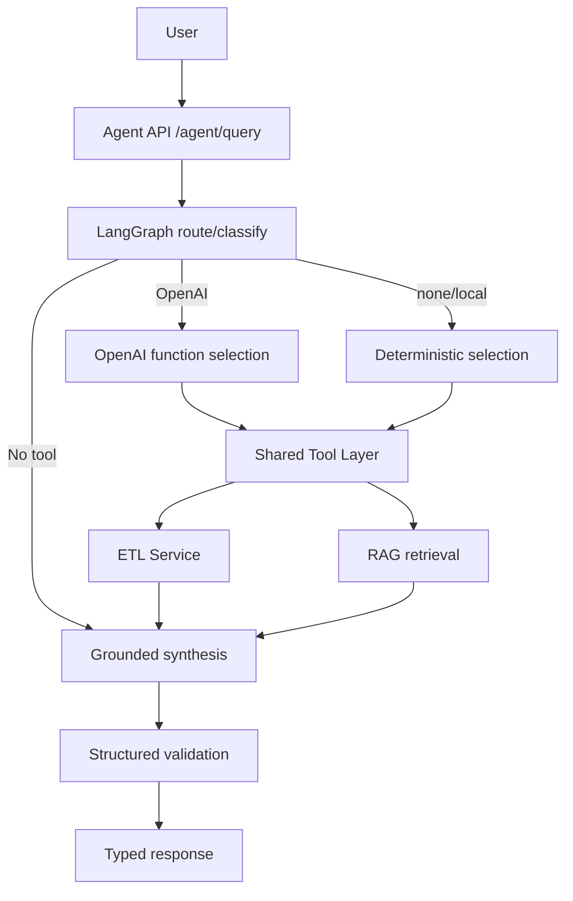

# ETL-RAG Observability Platform

A personal full-stack project for monitoring ETL pipelines, RAG workflows, and agent-based workflow execution.

I built this project to practice modern backend, data, and AI engineering concepts in one system. The main goal is to show how structured data pipelines and AI retrieval workflows can be tracked, evaluated, and reviewed through a simple dashboard.

---

## Problem

Data and AI workflows can fail in ways that are not always obvious.

Examples:
- an ETL pipeline may complete but still produce poor-quality data
- a RAG system may return an answer using weak or irrelevant retrieved context
- workflow failures may be hard to trace across multiple services

This project explores how these workflows can be monitored with run history, quality signals, risk flags, and step-level traces.

---

## Key Features

### ETL Pipeline

- Upload and process CSV datasets
- Profile columns, data types, missing values, and unique values
- Detect basic anomalies in datasets
- Calculate data quality scores
- Track ETL run status, timing, and metadata

### RAG Pipeline

- Upload text documents for retrieval
- Chunk and embed documents
- Store embeddings in ChromaDB
- Query documents using semantic retrieval
- Track retrieved chunks, sources, timing, and warning flags

### Observability Dashboard

- View ETL and RAG activity in one dashboard
- Track health scores, failures, and high-risk queries
- Review processing-time and quality trends
- Drill into individual ETL and RAG runs

### Agentic Workflow Layer

- Coordinate ETL and RAG workflows through an agent service
- Track planner, ETL, RAG, evaluator, and report steps
- Support human approval, reject, and retry flow
- Add a LangGraph-based workflow path for agent orchestration

---

## Architecture

```text
Streamlit Dashboard
        |
        v
Observability Service
        |
        +--> ETL Service
        |
        +--> RAG Service
        |
        +--> Agent Service
                |
                +--> Planner Agent
                +--> ETL Agent
                +--> RAG Agent
                +--> Evaluator Agent
                +--> Human Approval
                +--> Report Agent
```

---

## Tech Stack

### Backend
- Python
- FastAPI
- SQLAlchemy
- PostgreSQL
- Pandas

### AI / Data
- LangChain
- LangGraph
- ChromaDB
- Sentence Transformers

### Frontend
- Streamlit
- Plotly
- Pandas

### Tooling
- Docker
- Docker Compose
- Pytest
- Ruff
- Playwright

---

## What This Project Shows

### Backend Engineering
- FastAPI service design
- REST API development
- PostgreSQL data persistence
- Background processing
- Error handling and status tracking

### Data Engineering
- CSV ingestion
- ETL-style processing
- Data profiling
- Data quality checks
- Anomaly detection

### AI Engineering
- RAG workflow implementation
- Vector search
- Retrieval metadata tracking
- Basic retrieval risk evaluation
- LangGraph workflow experimentation

### Platform / Observability
- Microservice-based design
- Run tracking across services
- Health score calculation
- Failure monitoring
- Agent workflow tracing

### Testing
- Unit tests for ETL, RAG, and agent logic
- API health checks
- Frontend smoke tests
- Linting and coverage setup

---

## Configuration

Runtime configuration is supplied through environment variables. Copy `.env.example` to `.env` for local Docker Compose overrides; `.env` is ignored by Git. The current retrieval-only behavior does not require an OpenAI API key, and `LLM_PROVIDER` defaults to `none`.

```powershell
Copy-Item .env.example .env
docker compose up --build
```

The full test suite expects the Compose API services and Streamlit frontend to be running. Install `requirements-dev.txt` and the Playwright browser before running `python -m pytest`.

---

## OpenAI API Integration

The RAG service has a provider-independent LLM layer in `shared/llm`. The default `LLM_PROVIDER=none` path is free and preserves the original deterministic retrieval-only answer. `LLM_PROVIDER=local` is an explicit alias for the same no-network path. Neither mode requires an API key.

### Configuration and authentication

Copy `.env.example` to `.env` and select the provider through environment variables. `.env` is ignored by Git, and `OPENAI_API_KEY` is read only from the environment.

| Variable | Purpose | Default |
| --- | --- | --- |
| `LLM_PROVIDER` | `none`, `local`, or `openai` | `none` |
| `OPENAI_API_KEY` | OpenAI API authentication; required only for `openai` | empty |
| `OPENAI_MODEL` | Model sent to the Responses API | empty |
| `LLM_TIMEOUT_SECONDS` | Outbound request timeout | `60` |
| `LLM_MAX_RETRIES` | Retries after the initial transient failure | `2` |
| `LLM_RETRY_BASE_SECONDS` | Initial exponential-backoff delay | `0.5` |

OpenAI mode initializes lazily. Selecting `openai` without both a key and model returns a clear service error from the RAG request, but does not prevent service startup or health checks.

To enable real OpenAI generation:

```powershell
Set-Item Env:LLM_PROVIDER openai
Set-Item Env:OPENAI_MODEL your-enabled-model
Set-Item Env:OPENAI_API_KEY (Read-Host "OpenAI API key")
```

Do not put real credentials in `.env.example` or commit `.env`.

### RAG flow and response types

`POST /rag/ask` keeps the existing semantic retrieval and evaluation flow, then sends the question and retrieved context to the selected provider. OpenAI mode uses the official Python SDK and the Responses API's Pydantic structured-output support to produce a grounded `answer` and `sources`. The existing response fields remain, with these additions:

- `request_id`
- `provider`
- `model`
- `usage.input_tokens`
- `usage.output_tokens`
- `usage.total_tokens`

Model-returned sources are allowlisted against the retrieved source identifiers. Token usage is returned for later observability persistence but is not stored in PostgreSQL yet.

`POST /rag/ask/stream` returns Server-Sent Events with `metadata`, `delta`, `completed`, or `error` event types. The synchronous endpoint remains unchanged for existing clients. See the official OpenAI documentation for the [Responses API](https://developers.openai.com/api/docs/guides/latest-model), [Structured Outputs](https://developers.openai.com/api/docs/guides/structured-outputs), and [streaming responses](https://developers.openai.com/api/docs/guides/streaming-responses).

The provider layer disables SDK-level retries and applies one centralized bounded policy instead. Connection failures, timeouts, HTTP 408/409, rate limits, and server errors receive exponential backoff. Authentication and validation failures are not retried indefinitely.

Automated tests inject fake OpenAI clients and never call the real API. Run locally without paid usage using the defaults:

```powershell
$env:LLM_PROVIDER = "none"
python -m pytest tests/llm tests/rag
```

---

## Agentic Workflow

`POST /agent/query` adds a bounded, stateful LangGraph query path without replacing the existing deterministic approval workflows under `/agent/workflow`. The graph records a typed request state, classifies the route, conditionally selects and executes only the needed tools, synthesizes a grounded answer, and validates the final Pydantic response.

The provider-neutral registry in `shared/tools` defines strict Pydantic inputs and outputs for:

- `search_documents(query)`: calls retrieval-only `POST /rag/search` and returns ChromaDB evidence plus retrieval evaluation metadata.
- `get_dataset_schema(run_id)`: returns the persisted ETL column profile and schema issues.
- `get_dataset_profile(run_id)`: returns ETL quality, anomaly, dimension, and profile data.
- `get_pipeline_status(run_id)`: returns bounded ETL run status, timing, quality, and safe failure details.

For all ETL tools, `run_id=null` means the latest run. The project does not expose unrestricted SQL, arbitrary dataset rows, shell commands, or filesystem access. A general `query_dataset` tool is intentionally omitted because the current services do not own a safe bounded row-query API.



### OpenAI tool calling

When `LLM_PROVIDER=openai`, the provider sends the strict shared tool definitions to the Responses API with `tool_choice=auto`. LangGraph executes returned function calls after validating their JSON arguments, then sends `function_call_output` items back using the prior response ID. The continuation uses Pydantic structured output for `answer` and `sources`; returned sources are allowlisted against tool-provided identifiers. See the official OpenAI [function calling guide](https://developers.openai.com/api/docs/guides/function-calling).

OpenAI may select multiple tools in one iteration. Execution is bounded by `AGENT_MAX_TOOL_ITERATIONS`, `AGENT_MAX_TOOL_CALLS`, and `AGENT_RECURSION_LIMIT`. Invalid arguments, missing runs/documents, service timeouts, unknown tools, and provider failures produce sanitized workflow errors and a graceful final response rather than an uncontrolled loop or stack trace.

The API response includes `answer`, `sources`, `tools_used`, `request_id`, `provider`, `model`, and workflow metadata for the selected route, call count, execution duration, iterations, retries, errors, and token usage. These fields are hooks for later observability persistence; Phase 2 does not change the observability database or dashboard.

Example requests:

```powershell
Invoke-RestMethod -Method Post -Uri http://localhost:8003/agent/query `
  -ContentType application/json `
  -Body '{"query":"What is the quality score of the latest ETL run and what problems were detected?"}'

Invoke-RestMethod -Method Post -Uri http://localhost:8003/agent/query `
  -ContentType application/json `
  -Body '{"query":"Search the indexed documents for CPU embeddings and summarize the evidence."}'
```

With `LLM_PROVIDER=none` or `local`, the same endpoint uses deterministic route-to-tool selection and formats grounded tool results without an OpenAI key or paid API request. Automated tool and graph tests use fakes exclusively.

---

## Project Status

This is an ongoing personal project focused on backend engineering, data pipeline reliability, RAG observability, and agentic workflow orchestration.

## Author

Built by **Priya Prajapati (@Priya2149)** to demonstrate backend engineering skills with Python, FastAPI, ETL pipelines, RAG workflows, PostgreSQL, ChromaDB, and Docker.

* LinkedIn: https://www.linkedin.com/in/prajapatipriya/
* GitHub: https://github.com/Priya2149
